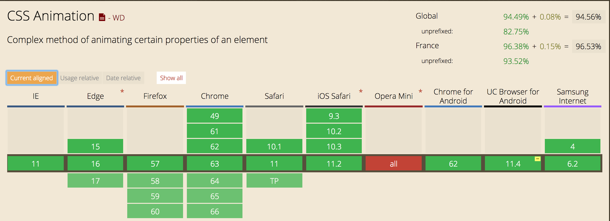

### Définition

CSS Transforms, CSS Transitions et CSS Animations sont 3 spécifications CSS distinctes 
même si elles paraissent parler de la même chose.

- Transform permet d'effectuer des translations, rotation, changement d'échelle... mais sans notion de temps.
- Transition permet les mêmes modifications mais à travers le temps.
- Animation permet de définir sa propre échelle de temps.

Les transitions et animations sont également possibles en JavaScript mais très grandement déconseillées.


### Compatibilité
 


On peut donc les utiliser partout. (qui utilise opéra Mini ?)


### Premier exemple

Créez un fichier HTML simple contenant le code suivant :

HTML
```html
<button>Mon Bouton</button>
```

CSS
```css
button {
  background-color: magenta;
  transition: background-color 200ms ease-in 50ms;
}

button:hover {
  background-color: rebeccapurple;
  transition: background-color 200ms ease-out 50ms;
}
```

Si on reprend dans le détail ce qui a été fait :

On définit une couleur de background pour le bouton.

Au hover, on définit une autre couleur.
Sans transition, le changement se ferait quand même mais de manière instantanée.

Création d'une transition au hover, sur la propriété `background-color`, d'une durée de `200ms`,
avec un timing `ease-out` (on reviendra dessus plus tard) et d'un délai initial de `50ms`.

Même chose sur l'état normal du bouton pour un retour à l'état initial de manière animée.

Améliorations :

```css
    button {
        width: 200px;
        height: 25px;
        cursor: pointer;

        color: black;
        background-color: magenta;
        transition: all 200ms ease-in 50ms;
        transition-property: background-color, color;
    }

    button:hover {
        color: white;
        background-color: rebeccapurple;
        transition: all 200ms ease-out 50ms;
    }
```

On travaille maintenant sur 2 propriétés à la fois.

[Fichier source](../00_examples/01_button.html)