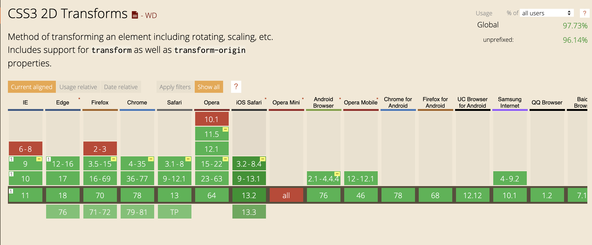

### Transformation

La propriété `transform` en css va, comme son nom l'indique, nous permettre de transformer un élément.

Il va nous être possible de :
- déplacer les éléments (translation `translate`) 
- de les tourner (rotation `rotation`)
- d'appliquer des homothéties (changement d'échelle `scale`) 
- de les distordre pour en changer la perspective (`skew`)
- ou encore d'appliquer une matrice de transformation (`matrix`)

Exemple de code CSS : 
```css
#maDiv {
  transform: translateX(200px);
}
```
Ici on déplace l'élément #maDiv de 200px vers la droite.

Autre exemple : 
```css
#maDiv {
    position: absolute;
    left: 50%;
    top: 50%;
    transform: translate(-50%, -50%);
}
```
Dans ce cas, on centre verticalement et horizontalement un élément dans son container. 


### Compatibilité
 
La propriété Transform peut être utilisé sans problème, elle est compatible avec 97% des navigateurs.



### Exercice

Téléchargez le fichier suivant et travaillez directement dessus : [fichier](./03-Transformations.html)

Faites en sorte qu'au hover, le bouton se déforme pour prendre la forme d'un losange et 
qu'il grandisse de x1.5 sa taille initiale.

