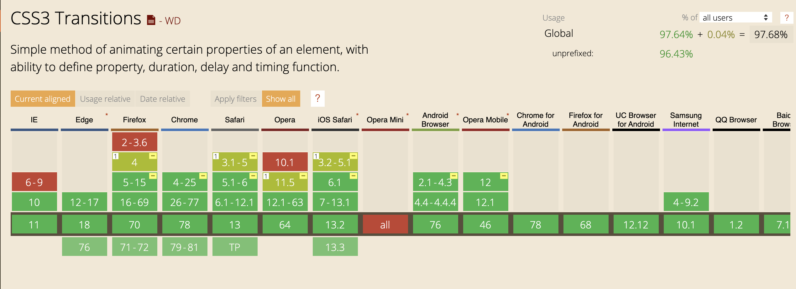

### Les transitions

Maintenant qu'on a les bases en CSS pour jouer avec les propriétés d'un élément, on va rendre ça un peu plus vivant.

Une animation de transition va nous permettre de passer d'un état A à un état B en définissant :
- la durée de la transition
- sur quelle(s) propriété(s) elle est appliquée
- la façon dont la transition s'exécutera (ease)

Il n'est pas possible d'appliquer une transition sur toutes les propriétés d'un élément.

Le meilleur exemple est la propriété `display`. On ne peut pas faire une transition d'un état en `display:none` à un `display:block`.
Simplement car il n'y a pas d'état intermédiaire entre les deux. Soit l'élément est visible, soit il ne l'est pas.
Pour le faire apparaitre progressivement, il faut jouer sur l'opacité (de 0 à 1).

Vous pouvez trouver [ici la liste des propriétés transitionable](./02-Transition-properties-list.md)

### Compatibilité 
 


97% de compatibilité. On peut donc les utiliser partout. (qui utilise opéra Mini ?)

Les transitions sont également possibles en JavaScript mais très grandement déconseillées.

### Premier exemple

Téléchargez le fichier suivant et travaillez directement dessus : [fichier](./01-Transitions.html)

Reprenons notre bouton et améliorons le rendu au hover. Ajoutez les 2 lignes suivantes à votre css.

CSS
```css
a.btn {
    transition-property: background-color;
    transition-duration: 600ms;
}
```

A présent, le rendu est déjà beaucoup plus agréable. 
Sans transition, le changement se fesait de manière instantanée, maintenant il se fait en 600 millisecondes.

> Valeur de durée 
> Il y a plusieurs manière d'indiquer une durée en CSS. Les 3 lignes suivantes ont la même valeur :
> - 600ms
> - 0.6s
> - .6s

On pourrait remplacer `background-color` par le mot clé `all` pour que la transition s'applique à toutes les propriétés
mais c'est plutôt déconseillé car gourmand en performance.

Maintenant, travaillons sur la flèche : 
- Faites en sorte que celle-ci soit toujours présente mais non visible à l'état initial.
- Recentrez le texte à l'état initial.
- Ajoutez une transition sur la flèche pour que celle-ci apparaisse progressivement.
- Ajoutez une transition sur la propriété translate pour placer correctement la flèche à la fin de l'animation.

Voilà, on a un bouton bien travaillé visuellement. La finition est beaucoup plus agréable et professionnelle.