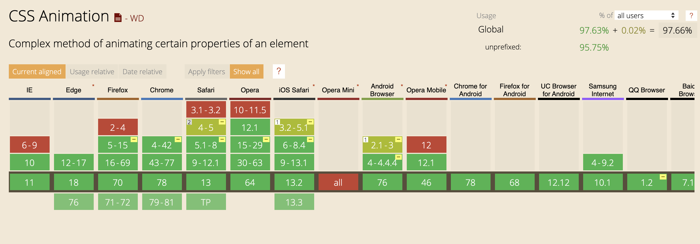

### Animations

La transition et l'animation, nous permettent d'animer des changements de propriétés sur des éléments HTML.
Dans les 2 cas, nous avons un état de départ et un état de fin.

La puissance de l'animation réside dans le fait qu'on va pouvoir définir toutes (ou une partie) des étapes intermédiaires.
Et ainsi avoir un contrôle total de notre animation.

Il faut imaginer une animation, comme une timeline où à chaque image clé vous pouvez définir les propriétés de votre objet et leurs valeurs.
Si vous avez déjà utilisé Adoble Flash ou After Effet, leur gestion de la timeline correspond tout à fait à
l'idée que je veux vous faire passer ici.

### Compatibilité 
 


97% de compatibilité. On peut donc les utiliser partout.

Les Animations sont également possibles en JavaScript mais très grandement déconseillées. 
Dès que possible, utilisez les en CSS.

### Premier exemple

Téléchargez le fichier suivant et travaillez directement dessus : [fichier](./01-Animations.html)

Nous allons créer notre première animation : 

```css

#target {
    animation-name: moveItmoveIt;
    animation-duration: 3s;
}

@keyframes moveItmoveIt {
  20% {
    transform: translateX(200px);
  }
  50% {
    transform: translateX(200px) translateY(40px);
  }
  100% {
    transform: translateX(200px) translateY(200px);
  }
}
```

Dans le détail, on associe une animation `moveItmoveIt` à notre target, d'une durée de 3 secondes.

On crée ensuite l'animation `moveItmoveIt` grace au mot clé `@keyframes` et on lui définit 3 étapes clées. A 20, 50 et 100% de l'animation.

Modifier le fichier, observer le comportement.

A présent : 
- Ajouter une propriété pour que le carré reste à sa place à la fin de l'animation
- Ajouter une propriété pour que l'animation se joue 10 fois
- Ajouter une propriété pour que l'animation se rembobine 
- Modifier une propriété pour que l'animation se joue à l'infini

Voilà, vous maitrisez les bases de l'animation en CSS !
