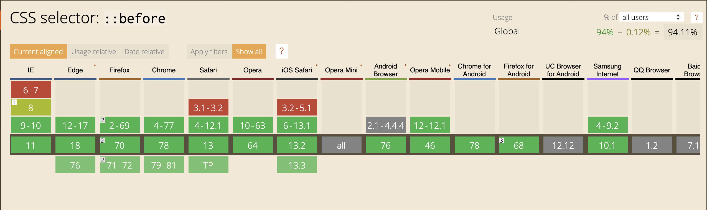

### Pseudo-éléments

Un pseudo-élément est un mot-clé qui s'ajoute à un sélecteur afin de l'appliquer à une partie spécifique de l'élément ciblé. 

Les 2 pseudo-éléments les plus utilisés sont [::after](https://developer.mozilla.org/fr/docs/Web/CSS/::after) et [::before](https://developer.mozilla.org/fr/docs/Web/CSS/::before)
qui respectivement permettent de créer un élément après et avant l'élément ciblé

Exemple de code CSS : 
```css
a:before {
  content: "♥";
}
```
Dans cet exemple, on ajoute un coeur avant chaque lien.


### Compatibilité
 
Plusieurs pseudo-éléments existent, comme le montre ce lien [https://developer.mozilla.org/fr/docs/Web/CSS/Pseudo-%C3%A9l%C3%A9ments#Liste_des_pseudo-%C3%A9l%C3%A9ments](https://developer.mozilla.org/fr/docs/Web/CSS/Pseudo-%C3%A9l%C3%A9ments#Liste_des_pseudo-%C3%A9l%C3%A9ments).
Mais les plus utilsés restent `before` et `after`.


Comme on peut le voir, aucun problème pour utiliser before et after.


### Exercices 

Téléchargez le fichier suivant et travaillez directement dessus : [fichier](02-Pseudo-elements.html)

Maintenant que notre bouton possède le comportement souhaité au hover, on va ajouter quelques détails.
Faites en sorte qu'au hover, ce symbole "→" apparaisse après le texte du bouton.


***

[Exercice suivant → Les Transformations](03-Transformations.md)