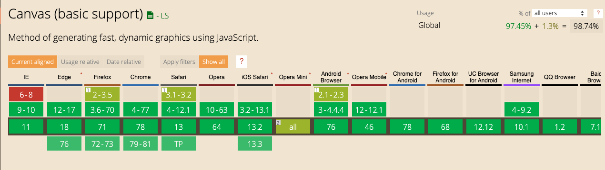
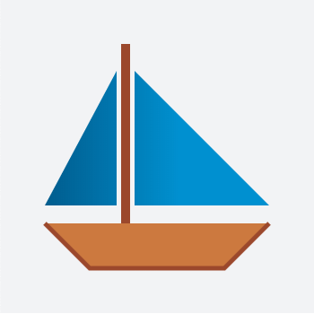

# Canvas

### Qu'est-ce qu'un Canvas

`<canvas>` est un élément HTML qui permet de dessiner des éléments graphiques à l'aide de scripts (habituellement JavaScript). 
Il peut par exemple : 
- dessiner des éléments 2D
- dessiner des éléments 3D 
- appliquer des filtres sur des images 
- réaliser des animations 

 
L'élément `<canvas>` n'est pas reconnu par tous les vieux navigateurs (notamment IE < 9), 
mais il est supporté par les versions les plus récentes des principaux. 
 
La taille par défaut de canvas est 300px × 150px (largeur × hauteur).
 

 
Longtemps en concurrence avec Flash en ce qui concerne les animations complexes et performantes, ainsi que pour les jeux, 
le contexte fait qu'aujourd'hui on serait sur une oposition `Canvas VS SVG`.

Comparatif entre Canvas et SVG :

- Vecteurs et bitmap

Les SVG sont des éléments vectoriels tandis qu'un Canvas fait des rendus Bitmap.

- DOM

Il est possible de parcourir un SVG, il s'agit d'un arbre XML complet. 
Avec la console de développement ou un éditeur de texte, il est facile d'en voir le contenu.

La balise canvas est insoluble. Sans lire le code JavaScript associé, il est impossible de voir et comprendre ce qu'il se passe (Pratique pour cacher le fonctionnement d'un projet).

- Rendu

Le rendu du contenu d'un canvas est identique sur tous les navigateurs compatibles.

Les rendus des SVG, notamment sur les élements complexes (filtres, ombres) peuvent différer sur les navigateurs.


### Premier Canvas

Vous pouvez utilisez ce fichier pour commencer : [fichier](01-Canvas-Drawing.html)

Ajoutez une balise canvas : 
```html
<canvas id="my-canvas" width="350" height="350"> </canvas>
```

Formidable, vous avez une page blanche !

Deux possibilités ici pour le faire ressortir, lui ajouter une bordure ou une couleur de fond.

```css
#my-canvas {
  background-color: #f4f5f6; 
}
```

Maintenant, nous avons besoin de JavaScript cibler notre `canvas` et interagir dessus. 

Ajoutez les lignes suivantes dans votre balise `<script>` : 

```javascript
var c = document.getElementById("my-canvas"); // On cible notre canvas grace à l'ID et on le met dans une variable
var ctx = c.getContext("2d"); // Récupère le contexte donne accès aux méthodes de dessin
// La suite du script ici...
```

Ces 2 lignes seront à écrire à chaque fois que vous utiliserez un canvas.


### Premier dessin

On va maintenant jouer avec les outils que nous fourni Canvas pour dessiner.

La première forme que l'on peut dessiner, ce sont des rectangles et des carrés avec la méthode [`fillRect`](https://developer.mozilla.org/fr/docs/Web/API/CanvasRenderingContext2D/fillRect).

A la suite de votre script, ajoutez les lignes suivantes : 

```javascript
ctx.fillStyle = "green"; // on détermine la couleur de remplissage
ctx.fillRect(10, 10, 100, 100); // coordonnées x, y de notre carré puis ses largeur, hauteur
```

Un carré vert doit apparaitre.

Exercice, reproduire le dessin suivant :


### Première ligne

Vous pouvez utilisez un nouveau fichier : [fichier](01-Canvas-Drawing.html)

Heureusement, on n'est pas limité au simple carré !

On peut aussi dessiner des formes complexes "Path" à base de tracés. 
Un tracé se déroule en plusieurs étapes : 
- initialisation 
- point de départ puis point d'arrivée
- on répète autant de déplacement que l'on souhaite
- clôture
- affichage du contour et/ou du remplissage.

Pour se le réprésenter, imaginez la pointe d'un crayon qu'on déplace.
On lui indique chaque étape de déplacement, avec des coordonnées x, y et à la fin on affiche le contour et/ou on remplit la forme crée.

```javascript
ctx.beginPath();      // Début du tracé
ctx.moveTo(50,50);    // Le tracé part du point x=50 et y=50
ctx.lineTo(200,200);  // Un segment est ajouté en direction du point x=200 et y=200
ctx.moveTo(200,50);   // Puis on saute jusqu'au point x=200 et y=50
ctx.lineTo(50,200);   // Puis on trace jusqu'à x=50 et y=200
ctx.closePath();      // Fermeture du tracé (facultatif)
ctx.stroke();         // Affichage du tracée
// ctx.fill();        // Remplissage de la forme
```

Une croix devrait apparaitre.

Exercice suivant, dessiner ce bateau :



Il faudra donc :
- créer 3 formes distinctes.
- jouer sur l'épaisseur des tracés.
- appliquer une couleur sur le tracé et sur le remplissage.
- appliquer un dégradé sur la voile.
