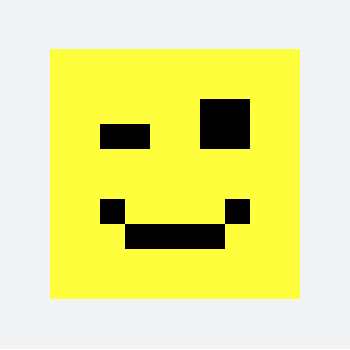
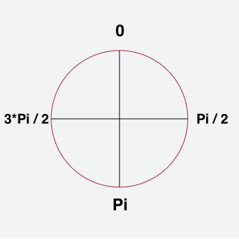
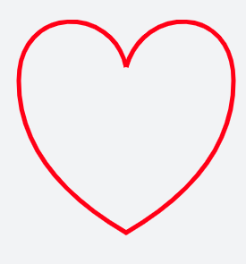

# Canvas

### Qu'est-ce qu'un Canvas

`<canvas>` est un élément HTML qui permet de dessiner des éléments graphiques à l'aide de scripts (habituellement JavaScript). 
Il peut par exemple : 
- dessiner des éléments 2D
- dessiner des éléments 3D 
- appliquer des filtres sur des images 
- réaliser des animations 

 
L'élément `<canvas>` n'est pas reconnu par tous les vieux navigateurs (notamment IE < 9), 
mais il est supporté par les versions les plus récentes des principaux. 
 
La taille par défaut de canvas est 300px × 150px (largeur × hauteur).
 

 
Longtemps en concurrence avec Flash en ce qui concerne les animations complexes et performantes, ainsi que pour les jeux, 
le contexte fait qu'aujourd'hui on serait sur une oposition `Canvas VS SVG`.

Comparatif entre Canvas et SVG :

- Vecteurs et bitmap

Les SVG sont des éléments vectoriels tandis qu'un Canvas fait des rendus Bitmap.

- DOM

Il est possible de parcourir un SVG, il s'agit d'un arbre XML complet. 
Avec la console de développement ou un éditeur de texte, il est facile d'en voir le contenu.

La balise canvas est insoluble. Sans lire le code JavaScript associé, il est impossible de voir et comprendre ce qu'il se passe (Pratique pour cacher le fonctionnement d'un projet).

- Rendu

Le rendu du contenu d'un canvas est identique sur tous les navigateurs compatibles.

Les rendus des SVG, notamment sur les élements complexes (filtres, ombres) peuvent différer sur les navigateurs.


### Premier Canvas

Vous pouvez utilisez ce fichier pour commencer : [fichier](01-Canvas-Drawing.html)

Ajoutez une balise canvas : 
```html
<canvas id="my-canvas" width="350" height="350"> </canvas>
```

Formidable, vous avez une page blanche !

Deux possibilités ici pour le faire ressortir, lui ajouter une bordure ou une couleur de fond.

```css
#my-canvas {
  background-color: #f4f5f6; 
}
```

Maintenant, nous avons besoin de JavaScript cibler notre `canvas` et interagir dessus. 

Ajoutez les lignes suivantes dans votre balise `<script>` : 

```javascript
var c = document.getElementById("my-canvas"); // On cible notre canvas grace à l'ID et on le met dans une variable
var ctx = c.getContext("2d"); // Récupère le contexte donne accès aux méthodes de dessin
// La suite du script ici...
```

Ces 2 lignes seront à écrire à chaque fois que vous utiliserez un canvas.


### Premier dessin

On va maintenant jouer avec les outils que nous fourni Canvas pour dessiner.

La première forme que l'on peut dessiner, ce sont des rectangles et des carrés avec la méthode [`fillRect`](https://developer.mozilla.org/fr/docs/Web/API/CanvasRenderingContext2D/fillRect).

A la suite de votre script, ajoutez les lignes suivantes : 

```javascript
ctx.fillStyle = "green"; // on détermine la couleur de remplissage
ctx.fillRect(10, 10, 100, 100); // coordonnées x, y de notre carré puis ses largeur, hauteur
```

Un carré vert doit apparaitre.

Exercice, reproduire le dessin suivant :



### Première ligne

Vous pouvez utilisez un nouveau fichier : [fichier](01-Canvas-Drawing.html)

Heureusement, on n'est pas limité au simple carré !

On peut aussi dessiner des formes complexes "Path" à base de tracés. 
Un tracé se déroule en plusieurs étapes : 
- initialisation 
- point de départ puis point d'arrivée
- on répète autant de déplacement que l'on souhaite
- clôture
- affichage du contour et/ou du remplissage.

Pour se le réprésenter, imaginez la pointe d'un crayon qu'on déplace.
On lui indique chaque étape de déplacement, avec des coordonnées x, y et à la fin on affiche le contour et/ou on remplit la forme crée.

```javascript
ctx.beginPath();      // Début du tracé
ctx.moveTo(50,50);    // Le tracé part du point x=50 et y=50
ctx.lineTo(200,200);  // Un segment est ajouté en direction du point x=200 et y=200
ctx.moveTo(200,50);   // Puis on saute jusqu'au point x=200 et y=50
ctx.lineTo(50,200);   // Puis on trace jusqu'à x=50 et y=200
ctx.closePath();      // Fermeture du tracé (facultatif)
ctx.stroke();         // Affichage du tracée
// ctx.fill();        // Remplissage de la forme
```

Une croix devrait apparaitre.

Exercice suivant, dessiner ce bateau :


Il faudra donc :
- créer 3 formes distinctes.
- jouer sur l'épaisseur des tracés.
- appliquer une couleur sur le tracé et sur le remplissage.
- appliquer un dégradé sur la voile.


### Première courbe

Vous pouvez utilisez un nouveau fichier : [fichier](01-Canvas-Drawing.html)

Ok, c'est gentil ces carrés et ces polygones, mais on peut pas mettre un peu de rondeur à tout ça ?

Si !

> Pour cela, il faut quelques notions de trigonométrie et connaitre la notion de Radian. 
> Il s'agit d'une unité de mesure pour les angles, basée sur la valeur de Pi. 
> Sachant que : 
> - 180° vaut Pi
> - 360° vaut Pi*2
> - 90° vaut Pi/2
>
> 
>

Pour dessiner des cercles ou des arcs nous avons plusieurs méthodes à disposition dont : [arcTo()](https://developer.mozilla.org/en-US/docs/Web/API/CanvasRenderingContext2D/arcTo) et [arc()](https://developer.mozilla.org/en-US/docs/Web/API/CanvasRenderingContext2D/arc).

Cette dernière sera la plus utilisée : 

```javascript
ctx.arc(x, y, rayon, angleDépart, angleFin)
```

Sur votre fichier, copiez le code suivant : 

```javascript
ctx.beginPath();                        // On début le tracé
ctx.arc(175,175,100,0,Math.PI*2,true);  // Dessine un cercle
ctx.strokeStyle = "black";              // On applique une couleur au tracé
ctx.fillStyle = "yellow";               // On applique une couleur de replissage
ctx.fill();                             // On affiche le remplissage
ctx.stroke();                           // On affiche le tracé
```

Dans le détail pour la création de notre cercle : 
- x=175 et y=175 est notre position initiale, c'est le centre du cercle
- 100 est le rayon de notre cercle
- 0 notre angle de départ, il s'agit du sommet du cercle.
- Math.PI * 2, l'angle de fin, on fait donc un tour complet

Ajoutez les lignes suivantes à votre canvas, observez le résultat :

```javascript
ctx.beginPath();
ctx.arc(175, 175, 60, 0, Math.PI);
ctx.strokeStyle = "red";
ctx.stroke();

ctx.beginPath();
ctx.strokeStyle = "#369";
ctx.fillStyle="#c00";
ctx.arc(205, 130, 15, 0, Math.PI*2);
ctx.stroke();
ctx.beginPath();
ctx.arc(145, 130, 15, 0, Math.PI*2);
ctx.stroke();
```

Pour les courbes plus particulières, on a 2 autres méthodes : [bezierCurveTo](https://developer.mozilla.org/fr/docs/Web/API/CanvasRenderingContext2D/bezierCurveTo) et [quadraticCurveTo](https://developer.mozilla.org/fr/docs/Web/API/CanvasRenderingContext2D/quadraticCurveTo)

Dans votre canvas, ajoutez les lignes suivantes : 

```javascript
ctx.beginPath();
ctx.moveTo(10, 10);
ctx.bezierCurveTo(230, 30, 150, 80, 250, 300);
ctx.strokeStyle = 'red';
ctx.stroke();

ctx.beginPath();
ctx.moveTo(10, 10);
ctx.quadraticCurveTo(0, 150, 250, 300);
ctx.strokeStyle = 'green';
ctx.stroke();
```

Les 2 lignes partent quasiment du même point et arrivent quasiment au même point (il y a un décalage de quelques pixels pour la lisibilité).
Chacune possédant des coordonnées lui faisant prendre une trajectoire différente.

Pour représenter visuellement les transformations. On va afficher les points de la courbe. 
Ajoutez les lignes suivantes : 

```javascript
// Points de départ et d'arrivée
ctx.fillStyle = "green";
ctx.beginPath();
ctx.arc(10, 10, 5, 0, 2 * Math.PI);   // Point de départ
ctx.arc(250, 300, 5, 0, 2 * Math.PI);  // Point d'arrivée
ctx.fill();

// Point de contrôle
ctx.fillStyle = 'green';
ctx.beginPath();
ctx.arc(10, 150, 5, 0, 2 * Math.PI);
ctx.fill();
```

Trois points verts apparaissent. 2 représentent le début et la fin de la ligne. 
Le 3e est celui qui crée la courbe. Imaginez qu'initialement, il s'agit d'une ligne droite et que plus on éloigne ce point de la droite, plus la courbure est accentuée.

Modifiez les valeurs (quadraticCurveTo et arc), pour voir le comportement.

Maintenant, ajoutez ces lignes : 

```javascript
// Points de départ et d'arrivée
ctx.fillStyle = 'red';
ctx.beginPath();
ctx.arc(30, 10, 5, 0, 2 * Math.PI);   // Point de départ
ctx.arc(280, 300, 5, 0, 2 * Math.PI); // Point d'arrivée
ctx.fill();

// Points de contrôle
ctx.fillStyle = 'red';
ctx.beginPath();
ctx.arc(150, 180, 5, 0, 2 * Math.PI);  // Point de contrôle 1
ctx.arc(280, 30, 5, 0, 2 * Math.PI);  // Point de contrôle 2
ctx.fill();
```

On affiche à présent les 2 points (début et fin) de la courbe de bézier. Ainsi que les 2 points qui appliquent la transformation.


Maintenant l'exercice, dessinez un coeur comme celui-ci : 




***

[Exercice suivant → Canvas - Les Animations](02-Canvas-animation.md)