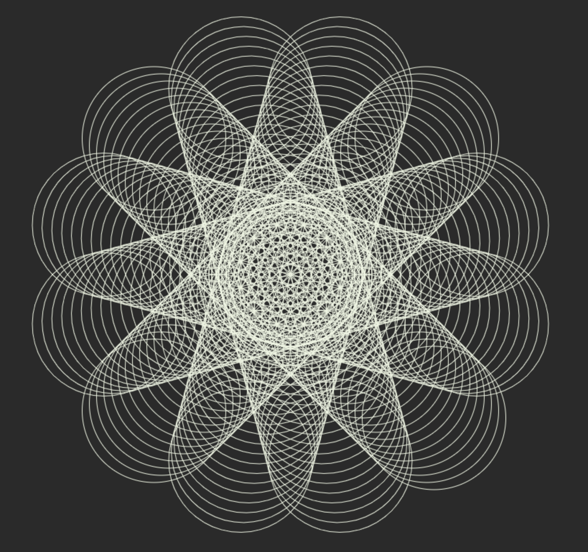

# Animation d'une rosace

L'objectif est d'arriver au résultat suivant à partir d'un cercle :



Pour cela vous pouvez utilisez la base suivante : [Fichier](Canvas-rosace.html)


### Taille du canvas

On peut gérer dynamique la taille d'un canvas, en lui attribuant une hauteur et largeur

```javascript
canvas.width = window.innerWidth;
canvas.height = window.innerHeight;
```

Couplet à l'event resize en JavaScript, on pourrait même le rendre responsive.

A présent faites en sorte qu'on travaille toujours à partir du centre du canvas.


### Le cercle

Le dessin de notre est assez simple : 

```javascript
ctx.beginPath();
ctx.strokeStyle = '#EDF5E1';
ctx.arc(x, y, 100, 0, Math.PI * 2);
ctx.stroke();
```

A présent voici les consignes pour générer la rosace :
- initialiser les var x, y et round, toutes à 0
- à chaque itération appliquer une rotation de 30 degré à notre cercle (30 * Math.PI / 180)
- incrémenté round de 30 à chaque itération
- dès que round vaut 7200 arrêter l'animation
- dès que round est un multiple de 360, incrémenté x et y de 10

Normalement, votre animation est complète.

Jouez avec les valeurs pour voir le rendu.