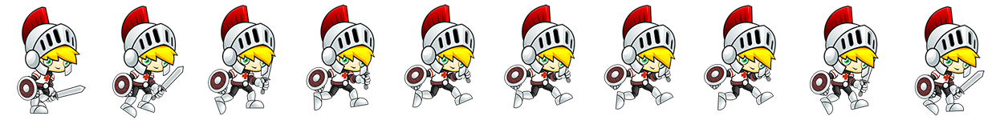

# Sprite Animations

Un sprite est une image contenant plusieurs images. 
En CSS, on va jouer sur la propriété `background-position` pour afficher l'image souhaitée en fonction du contexte.

Un sprite est utilisé dans 2 cas :

- sur le web classique, afin de regrouper l'ensemble des images de design et icônes en une image et 
ainsi limiter le nombre de requêtes http. Tout ceci dans un soucis de performance.

- dans le cas d'une transition d'image, type dessin animé. 

C'est ce 2e cas qu'on va voir ici.

## Exercice

### Créer le sprite

Téléchargez les sources suivantes : [Knight.zip](sources/freeknight.zip)

Ici les images sources sont séparées, trouver un outil permettant de générer des sprites.

On va travailler sur l'animation de saut (Jump).

> Attention !
>
> Pour générer un sprite correct, il faut : 
> - que les images de votre sprite soient sur une *seule ligne horizontale* 
> - dans le bon ordre chronologique
> - sans marge entre elle

Le résultat attendu : 




### CSS

Créer un nouveau fichier HTML de base.

Ajoutez votre chevalier à la page. Une seule des images du sprite doit être visible à la fois.

Propriétés de base :
```css
.knight {
  width: 587px;
  height: 707px;
  background: url('knight-jump-sprite.png');
}
```

On crée le keyframes.
```css
@keyframes jump {
   100% { background-position: -["587px * le nombre d'image de votre sprite"]; }
}
```
> Le code précédent est à modifier, `-["587px * le nombre d'image de votre sprite"]` ça n'existe pas en CSS !

A chaque étape de l'animation la position X du background position sera modifiée.


Création de l'animation
```css
.knight {
  ...
  animation: jump 0.8s steps(nb image de votre animation) infinite;
}
```
Tout se passe ici :
- on associe l'animation jump
- d'une durée de 800ms
- on divise l'animation en 10 étapes (nombre d'image du sprite)
- elle est jouée indéfiniment 


### Amélioration de l'animation

L'animation se produit, mais votre personnage ne saute pas encore.

Mettez en place le `transition transform` pour améliorer votre animation.

Utilisez les conseils de [cet article](https://css-tricks.com/making-css-animations-feel-natural/) pour améliorer le rendu de votre animation


### Keyboard Event

On va faire un peu de Vanilla JS ici.

Enlevez le infinite de l'animation et commentez l'animation sur votre chevalier pour le moment.

Faites en sorte que l'animation se déclenche lorsqu'on appuie sur la flèche du haut du [clavier](https://developer.mozilla.org/fr/docs/Web/API/KeyboardEvent). 
Par exemple en appliquant une [class](https://developer.mozilla.org/fr/docs/Web/API/Element/classList) `.jump` à votre chevalier au moment où on appuie sur la touche.

Faites en sorte que la classe `.jump` soit retirée à la fin de l'animation.


### La suite

Dans le même esprit, ajoutez les animations suivantes : 
- déplacement à droite (flèche droite du clavier).
- déplacement à gauche (flèche de gauche et nouvelle direction pour le chevalier).
- animation d'attaque lorsqu'on presse la barre d'espace.
- créez un moteur physique de rendu de la gravité et des collisions (non je déconne).


